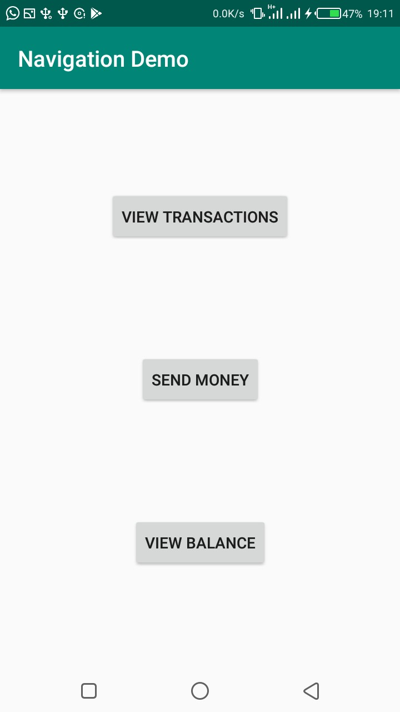
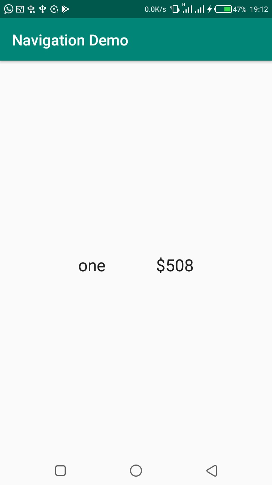
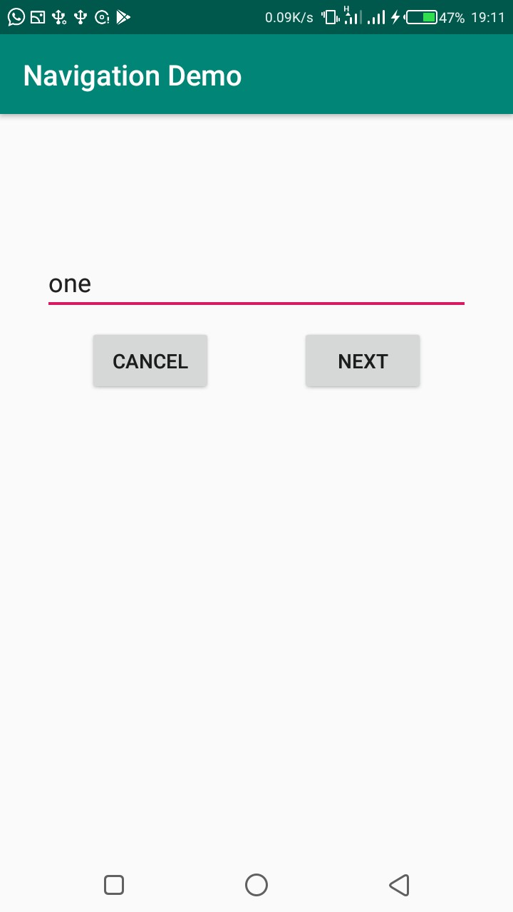
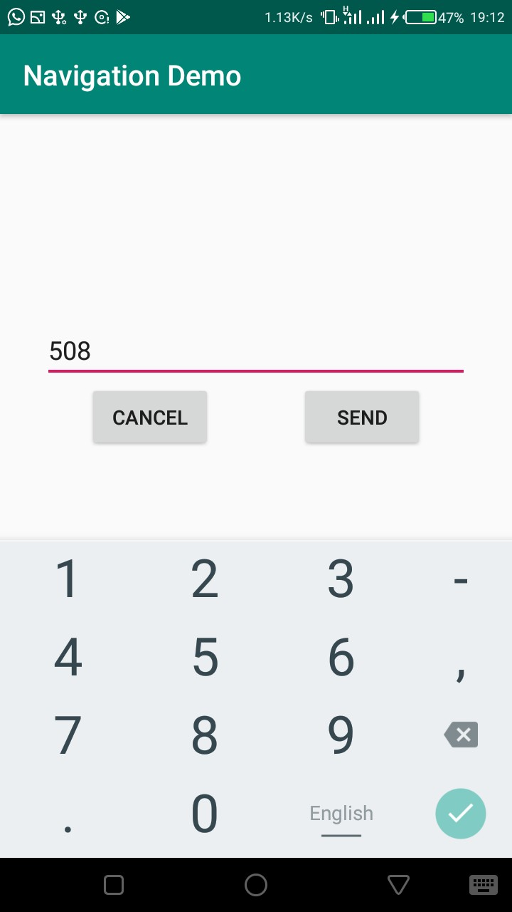
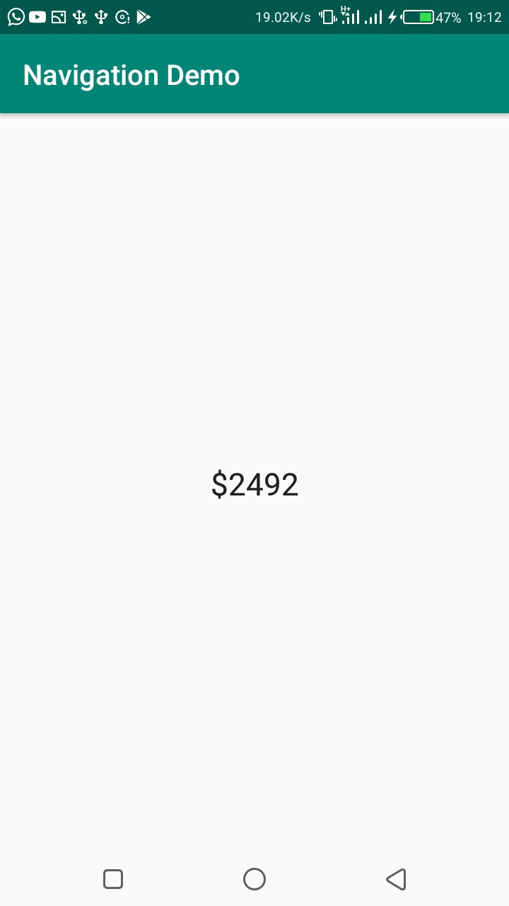

# Navigation Application
A demo app i built when studying the android navigation component for managing navigation in android apps.

## The App ##
Not quite long, Android released the **Navigation Archiecture Component** as part of the amazing *Android Jetpack*. This came as a solution to Android deveolopers that manage lots of views and layouts in their production code. Having a bunch of layout xml files playing aroung, when you have to look at it twice to remember why it was created in the first place. As android deveolopers, we struggle to create that mental model and program flow of the whole application in our heads. The Navigation AC has solved all of that for us. With the main feature being the management of different fragments and activities in the app, and how they move from one page to the other. While it was hard when I started out, after building this app, and configuring navigation and passing data between fragments, it kinda stuck!
The app i built uses the the library heavily. So it is made up of three main functions.

* Being able to send money (fictitiuos) to a recipient
* View transactions that have taken place
* View remaining balance

1. **Home Fragment**: The home page contains of three buttons, *View Transactions*, *Send Money*, *View Balance*. The button functions are pretty self-explanatory, so they simply take the user to the selected fragment.
2. **View Transations Fragment**: This fragment gets the list of transactions from the viewModel and displays the data, It displays **No transactions** if nothing has taken place.
3. **Send Money Fragment**: This fragment accepts the recipient the money is about to be sent to, and takes the user to the **SpecifyAmountFragment**, that accepts the amount to be sent, the recipient and amount are both sent as safe-args to the final fragment that displays a success message.
4. **View Balance**: This fragment simply displays the balance left after transactions. The default amount is $3000

## Components ##

* Android Mobile Framework
* Kotlin Programming Language
* Navigation Architecture Component
* Model-View-ViewModel - (MVVM)
* and the ever-sweet Databinding.

## Screenshots ##

     
